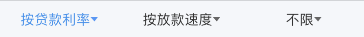
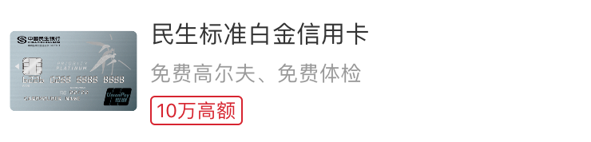
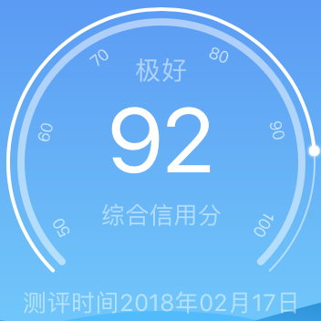

# 莫等钱包代码文档

## 语言
Swift 4

## 系统
支持iOS 9.0及以上

## 架构
基于MVC的架构，和传统MVC略有差别：  

- View：负责视图布局和触摸响应。
- Controller：负责页面生命周期，作为View的代理和数据源。
- Model：负责数据存储和数据获取（本地/网络）
- 和传统MVC最大差别就是数据获取的工作从Controller迁移到了Model。  

## pods
- SnapKit：代码约束布局框架，类似objC的Masonry。
- UIColor_Hex_Swift：UIColor的16进制构建方法扩展。
- TPKeyboardAvoiding：防止键盘弹出遮挡的插件。
- Alamofire：网络请求框架。
- SwiftyJSON：JSON解析框架。
- Kingfisher：网络图片加载框架。
- MJRefresh：列表下拉刷新/上拉加载插件。
- MBProgressHUD：弹出小提示框。
- CocoaSecurity：安全套件，用于MD5加密用户密码。
- FSTextView：一个有placeholder的textView。
- BRPickerView：选择插件，用于特殊详情页选取金额等。
- BEMCheckBox：带动画的打钩框。
- RxWebViewController：带关闭按钮和左滑返回上一页的webView封装。
- UMengAnalytics：友盟分析。
- UMengUShare/Social/WeChat：友盟微信分享。

## 文件结构
- Class：主要文件夹，存放代码文件。
	- Controller：控制器类。
		- Home：首页。
		- Loan：贷款产品列表页，贷款产品详情页。
		- CreditCard：银行卡列表页。
		- Mine：个人页面、设置页面、登录页面等。
		- Credit：信用查询相关页和信用报告页。
	- View：视图类。  
	- Model：模型类。
	- Service：数据获取相关类，封装网络框架。
	- Frame：框架类和ViewController基类。
	- Util：常亮定义。
	- App：AppDelegate，启动页，桥接文件。
- Other：图片集和info.plist文件。

## 类简介
#### Home
- LGHomeViewController  
	全页为UITableView，分为3个section：急速好贷、热门产品和信用卡产品。
- LGHomeModel  
	作为LGHomeViewController的数据模型，存储首页热门产品、信用卡产品和banner对象，并负责数据获取。
- LGHomeBannerModel  
	首页banner模型对象。
- LGHomeTableHeaderView  
	
- LGRecommendTableViewCell  
	
- LGCreditCheckTableViewCell  
	
- LGHotProductTableViewCell  
	

#### Loan
- LGLoanViewController  
	贷款产品列表页面，顶部为LGDropDownMenu，其余为UITableView。
- LGRecommendDetailViewController  
	特殊贷款详情页。
- LGNormalDetailViewController  
	普通贷款详情页。
- LGProductDetailViewController  
	特殊贷款产品的“查看详情”页面。
- LGLoanModel  
	作为贷款产品列表页的数据源，负责储存贷款产品数据列表和获取。
- LGLoanProductModel  
	贷款产品数据模型，作为详情页的数据源。
- LGLoanFlowModel  
	详情页贷款流程的数据模型。
- **RecommendDetail**和**NormalDetail**文件夹分别存放了特殊详情页和普通详情页的Cell，直接对应即可，不做详细介绍。  
- LGDropDownMenu  
	
	自行封装的下拉菜单控件，需要Controller作为其数据源和代理对象。  

#### CreditCard
- LGCreditCardViewController  
	银行卡列表页，顶部为LGDropDownMenu，其余为UITableView。
- LGCreditCardTableViewCell  
	

#### Mine
- LGMineViewController  
	“我的”页面首页，顶部为固定视图，中部为UICollectionView，底部为UITableView。
- LGVericationViewController  
	认证信息三元素页面。
- LGQuestionViewController  
	“常见问题”页面。
- LGMessageViewController  
	“消息中心”页面。
- LGRecordViewController  
	“申请记录”页面。
- LGQRCodeViewController  
	二维码页面，用于“客服服务”和“微信公众号”。
- LGMineModel  
	个人页面的数据模型，储存用户消息、申请记录和常见问题。
- LGQuestionModel  
	常见问题数据模型。
- LGUserModel  
	用户信息模型（单例），储存用户手机号，身份认证信息等，封装UserDefautlt持久化方法。
- LGMessageModel  
	消息数据模型。
- Mine中的View都是各类Cell，对应使用即可。

#### Credit
- LGCreditCheckFlowViewController  
	信用查询流程展示页。
- LGCreditCheckVericationViewController  
	信用查询身份认证页，展示用户三元素。
- LGCreditZhimaViewController  
	芝麻授权的H5页面。
- LGCreditCheckPayViewController  
	芝麻信用支付页。
- LGRecommendCodeViewController  
	邀请码填写页。
- LGReportViewController  
	芝麻信用报告页，全页面为UITableView。
- LGCreditView  
	，封装动画效果。
- 其余Credit下的View为Cell，对应使用即可。

#### Service
- LGHttpService  
	对Alamofire进行二次封装，暴露get和post方法，处理Cookie，处理错误码。
- LGHomeService、LGLoanService、LGCreditCardCervice、LGMineService、LGCreditService  
	分别对应五个主要视图的网络接口。
- LGUserService  
	负责用户相关网络接口，如登录、认证等。

#### Frame
- LGTabBarController  
	自定义TabBarController。
- LGNavigationController  
	自定义NaivgationController，设置颜色、返回键等。
- LGViewController  
	自定义ViewController基类。
- String+Index  
	字符串扩展，可以用索引操作字符串。
- LGWebViewController  
	简单封装RxWebViewController。